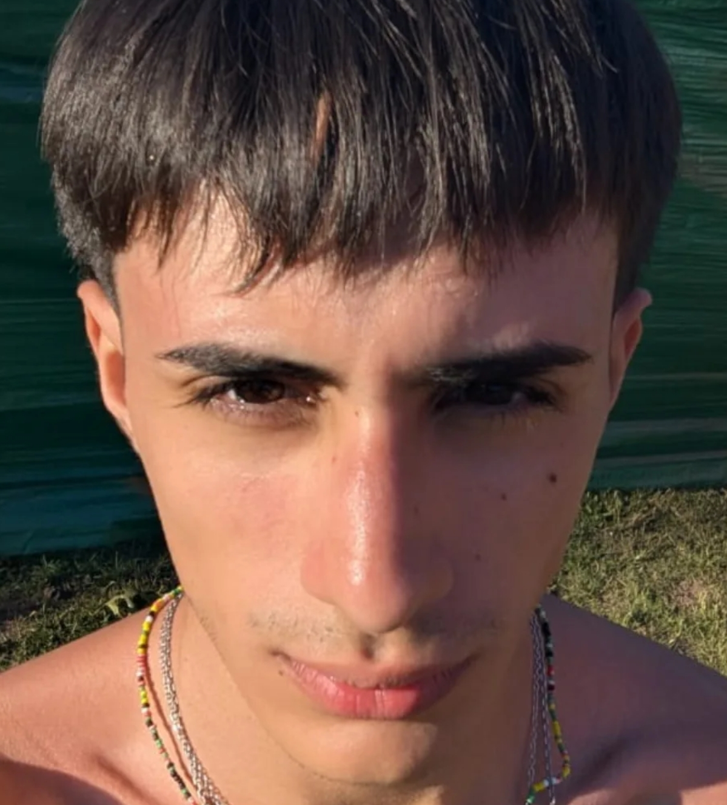

# Programación con objetos I
## Presentación Personal

### Datos Personales
- Mi nombre es: Nicolas
- Vivo en la localidad de Morón 

### Otra Información
- Desde muy temprana edad recuerdo que me gusto este mundo de la programación, de hecho empecé con una computadora de las antiguas, las cuales tenian 800 juegos y funcionalidades que no eran tan predecibles. Así mismo, mi mejor amigo y yo decidimos desde muy chicos seguir las misma carrera. Hasta el dia de hoy que estamos en la misma carrera. Apartir de mi primer contacto con una computadora comence a profundizar en la misma. 
- Sacando el hecho de la programación siempre me atrajo mucho la música, junto a la natación y el fútbol.
